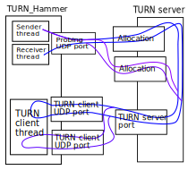

# TURN_Hammer

A tool to stress-test TURN (RFC 5766) servers and measure resulting packet loss and RTT.

There are pre-built versions on Github Releases

## Usage

```
Usage: turnhammer <server> <username> <password> [-j <parallel-connections>] [-s <pkt-size>] [--pps <pps>] [-d <duration>] [--delay-after-stopping-sender <delay-after-stopping-sender>] [--delay-between-allocations <delay-between-allocations>] [--calc] [-f] [--video] [--audio] [-J] [-C]


Options:
  -j, --parallel-connections
                    number of simultaneous connections
  -s, --pkt-size    packet size
  --pps             packets per second
  -d, --duration    experiment duration, seconds
  --delay-after-stopping-sender
                    seconds to wait and receive after stopping sender
  --delay-between-allocations
                    microseconds to wait between TURN allocations
  --calc            don't actually run, only calculate bandwidth and traffic
  -f, --force       override bandwidth or traffic limitation
  --video           set pps to 90 and pktsize to 960
  --audio           set pps to 16 and pktsize to 192
  -J, --json        output as JSON instead of plain text
  -C, --no-channels do not use chanels
  --help            display usage information
```

Output sample:

```
The test would do approx 11.878 Mbit/s and consume 158.379 megabytes of traffic
My external address: 178.122.56.8:40475
Allocated 200 TURN clients
Received the first datagram
Received 365652 packets from 384000 window of total 384000 || Loss: 04.7781%   bad loss: 00.0000%
RTT4 brackets: 0-49ms: 00.0000%   180-399ms: 50.7474%  1000-1999ms: 00.0000%
             50-179ms: 44.4745%   500-999ms: 00.0000%      2000+ms: 00.0000%
 <<<  Overall score:  8.2 / 10.0  >>>
Stopping TURN clients
```

JSON output sample:

```
$ turnhammer  -J --video -j 3 104.131.203.210:3478  u153   p1994421   2> /dev/null
{"status":"ok"
,"received_packets":1350 ,"min_max_window":1350 ,"sent_packets":1350
,"loss":0 ,"bad_loss":0
,"rtt4":{"0_49":0 ,"50_179":0 ,"180_399":100 ,"400_999":0 ,"1000_1999":0 ,"2000+":0}
,"score":9.5
}
```

## Algorithm

1. Create a UDP socket bound to `0.0.0.0:0`.
2. Get external address the socket
3. Create K other UDP sockets bound to `0.0.0.0:0` and obtain K allocations from specified TURN server
4. Add permission to address from "2." to each of that TURN allocations
5. In each of TURN client instance, send back each data message back to sender. This effectively makes K instances of UDP echo server at TURN side.
6. From the first UDP socket, send specified number of packets at specified rate to all those "echo servers".
7. Analyse replies from those "echo servers" and measure packet loss and round-trip times.



## Stress testing guideline

If you want to use turnhammer to measure maximum performance of your TURN server, approximately follow these steps:

1. On a separate node (not in the system that hosts the TURN server itself) start a turnhammer instance and ensure lightweight load produces good score.
2. Ramp up sinlge node's load until the score starts to drop.
3. Assume that this level of load is a client (i.e. turnhammer's limitation) limitation. Roll back the load somewhat (e.g. by 30%), so that score is good again.
4. Add more instances turnhammer (not within the same operating system, e.g. more VPS or physical nodes) and start them all simultaneously, with the same settings as "3.".
5. As more and more turnhammer instances get simultaneously active, scores reported by individual turnhammer instances would eventually slump. This time assume it was caused by server overload (not client overload like in "2."). But if, for example, all turnhammer nodes were located in the same network segment then it can be still probing issue.

Note that there are currently some bugs in score calculation - if you see unrealisting values and large negative scores then it is a bug in turnhammer. But that bug should not happen when TURN server connection is working well.

Measuring CPU load may be helpful in the research, but do not get to 100% client or server CPU loads during tests. 

## Old version

There is old Tokio 0.1-based version of turnhammer, tagged `v0.1.0` that can be built with older Rust and may support more old systems. It should work with rustc 1.34.2.
